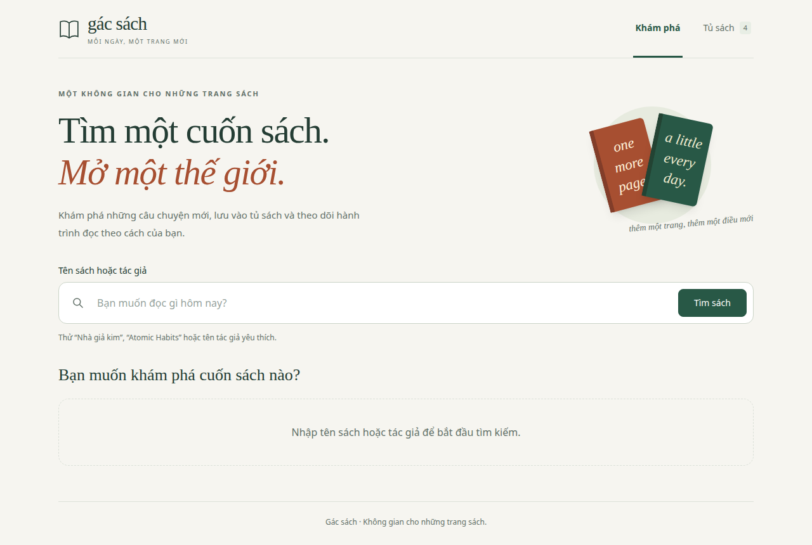
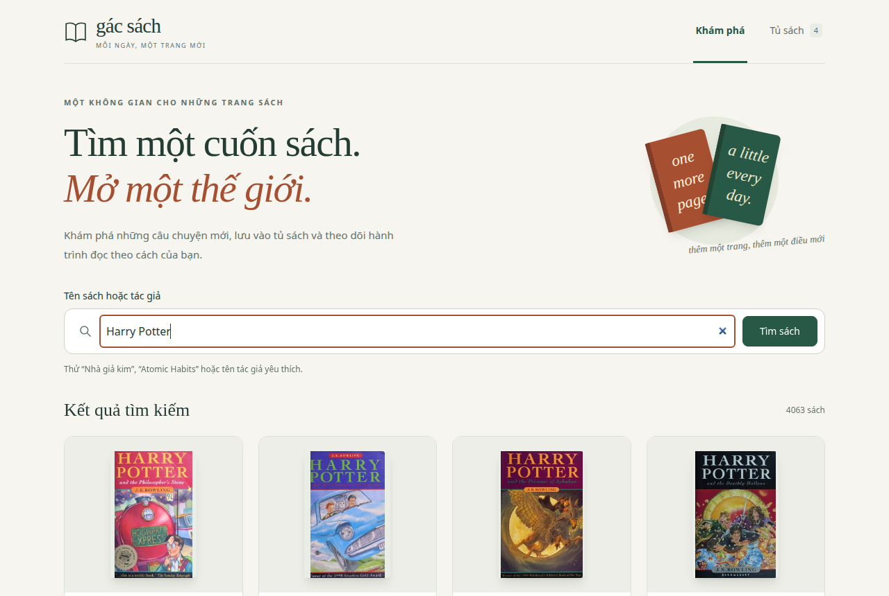
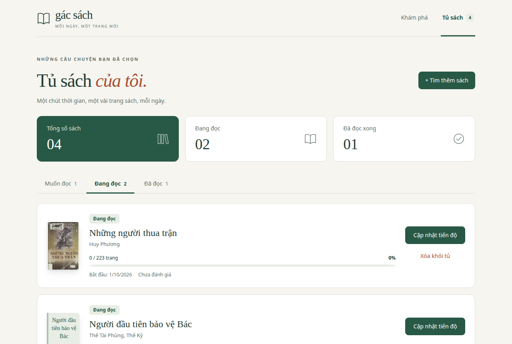
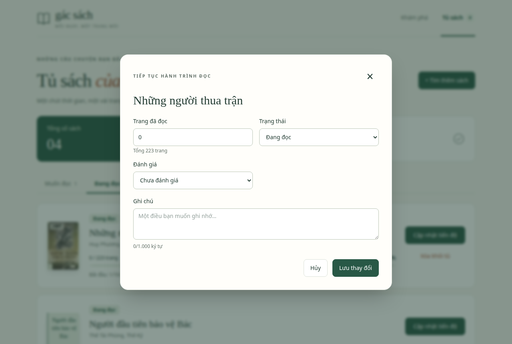
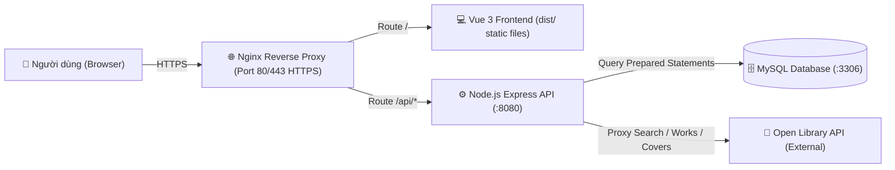
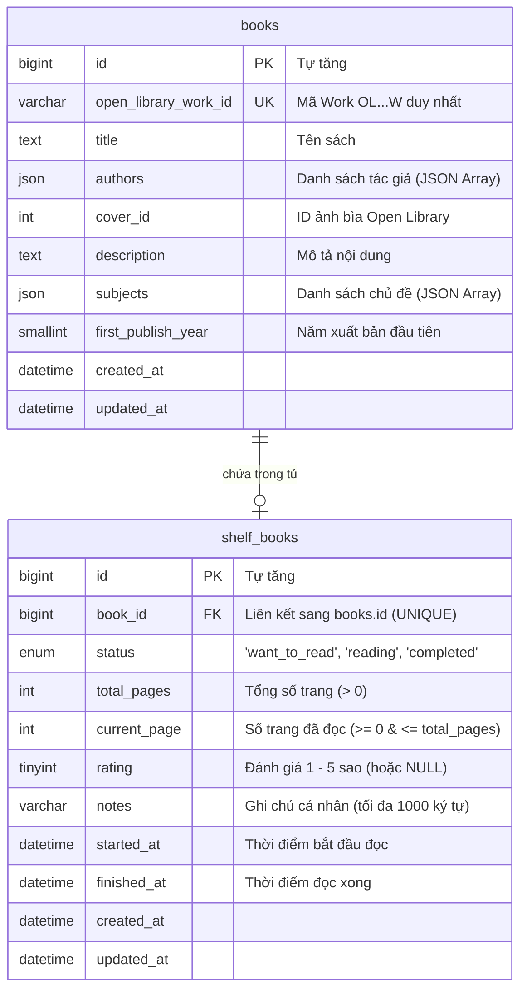

# 📚 Mini Reading Tracker — Ứng dụng Theo dõi Đọc sách Cá nhân

> Bài test Fullstack: Xây dựng ứng dụng web tìm kiếm sách, lưu vào tủ sách cá nhân và theo dõi tiến độ đọc sách sử dụng public API Open Library, lưu trữ MySQL và deploy hoàn chỉnh lên môi trường public HTTPS.

---

## 🌐 Đường Dẫn Demo & Repository

* **Frontend Web (Production HTTPS)**: [https://107.167.81.82.sslip.io](https://107.167.81.82.sslip.io)
* **Backend API Health Check**: [https://107.167.81.82.sslip.io/api/health](https://107.167.81.82.sslip.io/api/health)
* **GitHub Repository**: [https://github.com/phamdungdev03/reading-tracker](https://github.com/phamdungdev03/reading-tracker)
* **Môi trường triển khai**: Ubuntu 22.04 LTS VPS, Nginx Reverse Proxy, Systemd Service, Let's Encrypt SSL (HTTPS).

---

## 📸 Ảnh Chụp Màn Hình Giao Diện (Screenshots)

| 1. Trang chủ Tìm kiếm | 2. Kết quả tìm kiếm Open Library |
| :---: | :---: |
|  |  |

| 3. Chi tiết tác phẩm (Modal) | 4. Tủ sách cá nhân & Thống kê |
| :---: | :---: |
|  |  |

| 5. Cập nhật tiến độ & Chấm sao |
| :---: |
|  |

---

## 🛠 Công Nghệ Sử Dụng (Tech Stack)

| Thành phần | Công nghệ / Thư viện | Mô tả |
| :--- | :--- | :--- |
| **Frontend** | Vue 3.5 (`<script setup>`), TypeScript | Giao diện Single Page Application hiện đại, type-safe |
| **Styling** | Tailwind CSS 4 | Utility-first CSS, responsive hoàn chỉnh từ mobile đến desktop |
| **Routing** | Vue Router 4 | Điều hướng trang với HTML5 History mode |
| **Build Tool**| Vite 8 | Tối ưu hóa bundle và hot module replacement |
| **Backend** | Node.js, Express, TypeScript | RESTful API phân tầng rõ ràng (Router, Controller, Service, Repo) |
| **Database** | MySQL 8.0 | Lưu trữ metadata sách và tủ sách, toàn vẹn dữ liệu với Foreign Key & Constraints |
| **DB Client** | `mysql2` (Connection Pool) | Tối ưu hóa kết nối, chống SQL Injection với Prepared Statements |
| **Public API**| Open Library Books API | Tích hợp tìm kiếm tác phẩm, chi tiết sách và ảnh bìa qua Backend proxy |
| **Web Server**| Nginx 1.18 | Phục vụ static files Vue SPA, Reverse Proxy `/api` sang Backend Node.js |
| **SSL/HTTPS** | Certbot / Let's Encrypt | Chứng chỉ HTTPS hợp lệ, tự động redirect HTTP $\rightarrow$ HTTPS |
| **Process** | Systemd | Quản lý tiến trình Backend chạy ngầm liên tục và tự khởi động lại |

---

## 🏛 Kiến Trúc Hệ Thống (Architecture)

Toàn bộ các request từ trình duyệt **tuyệt đối không gọi trực tiếp sang Open Library**, mà luôn đi qua Nginx và Backend Node.js để kiểm soát bảo mật, chuẩn hóa dữ liệu và cache metadata.



---

## 🗄️ Thiết Kế Cơ Sở Dữ Liệu (Database Schema)

Cơ sở dữ liệu gồm 2 bảng quan hệ chặt chẽ:
1. `books`: Lưu trữ thông tin metadata của tác phẩm (lấy từ Open Library và lưu lại).
2. `shelf_books`: Lưu trạng thái tủ sách của người dùng, tiến độ đọc, đánh giá và ghi chú.



---

## 🎯 Quy Tắc Nghiệp Vụ Đã Đảm Bảo (Business Rules)

1. **Chống trùng lặp**:
   * Khi thêm cuốn sách đã có trong tủ sách $\rightarrow$ Backend lập tức trả về mã lỗi **`409 Conflict`**.
   * Bảng `shelf_books` có ràng buộc `UNIQUE (book_id)` để đảm bảo toàn vẹn dữ liệu ở cấp độ database.
2. **Ràng buộc tiến độ đọc**:
   * Ràng buộc $0 \le \text{current\_page} \le \text{total\_pages}$ được kiểm tra ở cả Frontend lẫn Backend và `CHECK constraint` trong MySQL.
   * **Tự động chuyển trạng thái**: Khi người dùng cập nhật `current_page == total_pages` $\rightarrow$ Hệ thống tự động chuyển sang trạng thái **Đã đọc** (`completed`) và ghi nhận `finished_at = NOW()`.
   * Khi cập nhật số trang $0 < \text{current\_page} < \text{total\_pages}$ $\rightarrow$ Tự động chuyển sang **Đang đọc** (`reading`).
3. **Mốc thời gian đọc**:
   * Chuyển sang **Đang đọc** lần đầu $\rightarrow$ Ghi nhận `started_at = NOW()`.
   * Chuyển sang **Đã đọc** $\rightarrow$ Ghi nhận `finished_at = NOW()`.
4. **Đánh giá & Ghi chú**:
   * Điểm đánh giá là số nguyên từ 1 đến 5 sao hoặc để trống (`null`).
   * Ghi chú tối đa 1.000 ký tự.
5. **Chuẩn hóa lỗi (Error Envelope)**:
   * Mọi response lỗi đều theo một format thống nhất:
     ```json
     {
       "error": {
         "code": "BOOK_ALREADY_IN_SHELF",
         "message": "Cuốn sách này đã có trong tủ sách của bạn."
       }
     }
     ```

---

## 📋 Danh Sách API Backend

| Phương thức | Endpoint | Chức năng | Tham số / Body |
| :--- | :--- | :--- | :--- |
| `GET` | `/api/health` | Kiểm tra trạng thái BE & MySQL | None |
| `GET` | `/api/books` | Tìm kiếm sách qua Open Library | Query: `?q={keyword}&page={n}` |
| `GET` | `/api/books/:workId` | Lấy chi tiết tác phẩm | Param: `workId` (ví dụ `OL82563W`) |
| `GET` | `/api/covers/:coverId`| Proxy ảnh bìa sách | Param: `coverId` |
| `GET` | `/api/shelf` | Lấy toàn bộ tủ sách & thống kê | None |
| `POST` | `/api/shelf` | Thêm sách mới vào tủ | Body: `{ workId, status, totalPages }` |
| `PATCH`| `/api/shelf/:id` | Cập nhật tiến độ / trạng thái / sao | Body: `{ status?, currentPage?, rating?, notes? }` |
| `DELETE`| `/api/shelf/:id`| Xóa sách khỏi tủ | Param: `id` (shelf item ID) |

---

## 🚀 Hướng Dẫn Cài Đặt & Chạy Local

### 1. Chuẩn bị môi trường
* Node.js `>= 22` hoặc `>= 24`
* MySQL Server `>= 8.0`

### 2. Khởi tạo Cơ sở dữ liệu
Import schema từ file SQL:
```bash
mysql -u root -p < Documents/database/reading-tracker.sql
```

### 3. Cài đặt và chạy Backend (`tracker_be`)
```bash
cd tracker_be
npm install
cp .env.example .env
# Điền mật khẩu MySQL vào .env
npm run dev
```
Backend sẽ khởi chạy tại: `http://localhost:8080` (hoặc cổng cấu hình).

### 4. Cài đặt và chạy Frontend (`tracker_fe`)
Mở cửa sổ terminal mới:
```bash
cd tracker_fe
npm install
npm run dev
```
Frontend sẽ khởi chạy tại: `http://localhost:5173`.

---

## 🚢 Quy Trình Triển Khai Thực Tế (Deployment Guide)

Ứng dụng được triển khai trên VPS Ubuntu 22.04 LTS:

1. **Cơ sở dữ liệu**:
   * Cài đặt MySQL 8.0 trên VPS.
   * Tạo cơ sở dữ liệu `reading_tracker` và cấp quyền cho user `reading_app`.
2. **Backend**:
   * Chạy bằng user không đặc quyền (`deploy`) tại `/home/deploy/reading-tracker/tracker_be`.
   * Cấu hình biến môi trường production trong `.env` (`chmod 600 .env`).
   * Biên dịch TypeScript: `npm run build`.
   * Đăng ký dịch vụ hệ thống với **Systemd** (`/etc/systemd/system/reading-tracker-be.service`):
     ```bash
     systemctl enable --now reading-tracker-be
     ```
3. **Frontend**:
   * Biên dịch mã nguồn Vue tĩnh: `npm run build` ra thư mục `dist/`.
4. **Nginx & HTTPS**:
   * Cấu hình Nginx làm Web server phục vụ `dist/` và Reverse proxy cho `/api` về cổng `8080`.
   * Sử dụng tên miền công khai tự động trỏ IP: `107.167.81.82.sslip.io`.
   * Kích hoạt chứng chỉ bảo mật HTTPS miễn phí với **Certbot (Let's Encrypt)**:
     ```bash
     certbot --nginx -d 107.167.81.82.sslip.io
     ```

---

## 💡 Giả Định, Hạn Chế & Hướng Cải Thiện

* **Giả định**: Ứng dụng phục vụ một người dùng duy nhất, không yêu cầu xác thực người dùng.
* **Hạn chế**: Dữ liệu Open Library phụ thuộc vào upstream API nên tốc độ tìm kiếm có thể thay đổi tùy tình trạng mạng quốc tế.
* **Hướng cải thiện**:
  * Tích hợp Authentication (JWT / Google OAuth) để hỗ trợ nhiều tài khoản người dùng độc lập.
  * Thêm Redis Cache cho các truy vấn tìm kiếm phổ biến và thông tin tác phẩm từ Open Library.
  * Hỗ trợ Progressive Web App (PWA) để đọc và ghi chú offline.
  * Biểu đồ trực quan hóa tiến độ đọc theo thời gian (Reading Challenge hàng năm).